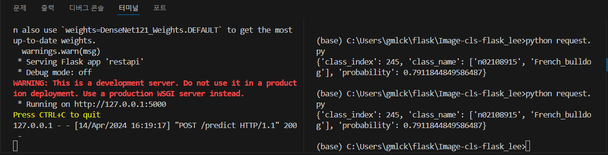

# Project_Image_cls_Flask

Flask 서버 구축 및 torchvision 이미지 분류 모델 별 성능 Test
   

   
## Object

Flask는 웹 애플리케이션을 구축하는 데 필요한 핵심 기능을 제공합니다.

해당 모델에서는 Mlops를 사용 하기 전 기초적인 Flask 서버를 구축하는 형태를 학습하고

이미지 분류 모델서빙을 진행하면서 torchvision에서 제공하는 분류모델의 성능과 특징을 살펴봅니다.
   
## torchvision_cls_model

   
## Libraries used / Version

- numpy 1.26.4
- Flask  2.3.0
- flask-restx 1.3.0
- torchvision 0.17.1
- jsonify
   
## model explanation

- densenet121 : 0~999 번 까지의 동,식물의 종류마다 소분류한 클래스들로 구성되었습니다.
- 

   
## Version

- python 3.12.2
- numpy 1.26.4
- pandas 2.2.1
- opencv-python 4.9.0.80
- ultralytics 8.1.19
   
## Result

